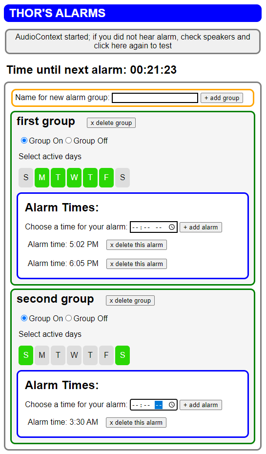

# Alarms For Thor

## Website with multiple configurable alarms

A friend is a teacher who needed a series of alarms to sound from a Chromebox. During the school day, he has multiple periods and he needs an audible alarm to play a short time before the end of the period so that the students are reminded to clean up before they leave for the next class. The schedule of class periods can vary from day to day and week to week, so alarm groups can be created and turned on and off.

## Table of Contents

- [Installation](#installation)
- [Usage](#usage)
- [License](#license)
- [Questions/Contributing](#questionscontributing)
- [Thanks](#thanks)

## Installation

This project uses vanilla HTML, JavaScript, and CSS. Once you have pulled the files to a folder on your local computer, the project should run without additional installation steps by pointing your browser to `index.html` in that folder.

## Usage

IMPORTANT: It is necessary to interact with the page so that it can make sounds. Chrome and other browsers prevent webpages from making sounds unless the user has interacted with the webpage. This is the reason for the "CHECK SPEAKERS" button.

When the browser opens the HTML file the first time, there are no alarms set.

Alarms are grouped, so first go to the bottom of the page and click the "+ Add Group" button (you can create a group name if you wish, but this is optional). Multiple groups can be created if desired.

Once a group is created, you can add an alarm to the group by entering a time at the "Choose a time for your alarm" prompt then clicking the "+ add alarm" button. Add more alarms if desired using this procedure.

Within a group, it is possible to select active days and to turn the group off or back on again. There is also a button to delete a group.

There's a customized version of this app deployed [here](https://stuart-rickard.github.io/alarm-thor-xp/).

## License

This project is licensed using an MIT License.

See the [license](./LICENSE) file for license rights and limitations.

## Questions/Contributing

Please feel free to contact me if you have questions or would like to contribute.

## Thanks

Thanks to Bimo on [stackoverflow](https://stackoverflow.com/questions/879152/how-do-i-make-javascript-beep) and to Carlos Delgado on [ourcodeworld](https://ourcodeworld.com/articles/read/1627/how-to-easily-generate-a-beep-notification-sound-with-javascript) for guidance about making sounds.  
Thanks to steelwater on [codepen](https://codepen.io/steelwater/pen/BjeZQx) for day of week buttons example.  
Thanks to Sooraj on [DEV](https://dev.to/soorajsnblaze333/generic-snippets-dom-element-creation-3go9) for suggestions about element creation.
